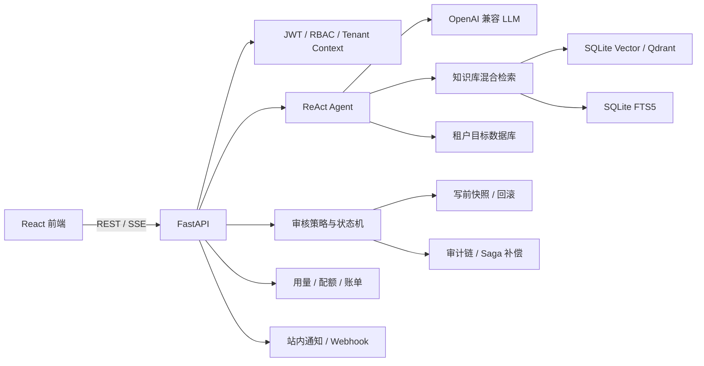

# SQL-RPA

SQL-RPA 是一个面向数据库问答与受控自动化操作的智能 Agent。用户可以使用
自然语言查询数据库、检索企业知识库，并将 INSERT、UPDATE、DELETE 等写操作
提交人工审核；系统提供写前快照、回滚、审计、用量统计、通知和多租户基础能力。

## 当前状态

核心业务链路已经可运行，前后端均包含认证、数据库操作、文档问答、审核、
用量和管理页面。当前仓库仍处于整改与验收阶段，请注意以下边界：

- 后端本地全量回归为 `235 passed, 5 skipped`；组织核心模块覆盖率为 statement
  `96.28%`、branch `96.43%`，已经达到 90%/85% 门槛。5 个跳过项仍为真实
  MySQL、PostgreSQL、Qdrant、Redis 及多进程容器测试，正式交付前必须取得执行证据。
- 前端 lint、组织契约扫描和生产构建通过；Vitest `16` 个文件、`55 passed`；
  Playwright 部门套件 `6 passed`、用户套件 `10 passed`，100 次组织切换旧请求回灌为 `0`。
- 2026-08-28 最新 Bugbot 仍发现 3 个后端 P1：跨层级审批执行/回滚可能使用错误的
  组织数据库连接、部门管理员可操作平台级配置和密钥轮换、支付 Webhook 被 Bearer
  认证提前拦截。在修复并复审前，整体整改不得标记完成。
- 最新整改和审查结论见
  [整改待办清单.md](整改待办清单.md) 与 [reviews](reviews/)。

## 功能模块

### Agent 与数据库

- ReAct Agent：意图分类、工具调用、SSE 流式输出、上下文裁剪和工具重试。
- 自然语言查库：生成并执行只读 SELECT，默认最多返回 500 行。
- 目标数据库：SQLite、MySQL、PostgreSQL；多租户模式支持为每个租户配置独立
  目标数据库连接。
- 写操作审核：INSERT、UPDATE、DELETE 进入审核队列，支持预览、指派、升级、
  过期、批量处理、双人审批、执行结果和事件记录。
- 写前保护：目标行快照、快照加密、主键恢复、反向备份及受控回滚。
- 执行补偿：使用 Saga 记录目标数据库已提交但内部记录待修复的状态，后台任务
  可修复审计和审核结果，不重复执行目标 SQL。

### 知识库与记忆

- 文档上传、解析、分块、嵌入、重处理和进度查询。
- PDF、Word、Excel、CSV 等常见格式解析以及 Tesseract OCR 回退。
- 向量检索与 SQLite FTS5 关键词检索融合，可选 Cross-Encoder 重排序。
- Qdrant 或 SQLite 向量存储。
- 用户长期记忆、事实管理和用户画像生成。
- 可选 DuckDuckGo 网络搜索回退。

### 认证、多租户与商业化基础

- JWT 登录和 viewer、operator、approver、admin 角色。
- Tenant、Membership、租户切换、成员管理及租户级数据库配置。
- LLM token、模型和成本用量记录。
- 用户配额、原子额度预留与结算。
- 发票、发票明细、支付记录及支付 Webhook。
- 首次使用引导、用量页面、账单页面和租户管理页面。

### 安全、审计与运维

- SQL 安全检查、单语句限制、表名/列名白名单和方言化标识符引用。
- 查询、工具结果和数据浏览的确定性敏感字段脱敏。
- AES-256-GCM 凭据及快照加密、版本化密钥和批量重加密。
- 提交人与审批人分离，高危操作支持四眼原则。
- 审计日志序号、哈希链、链完整性检查和恢复任务。
- 可配置审批策略：表、操作类型、影响行数、字段敏感度及审批人数。
- 站内通知、Webhook 端点、通知偏好和后台投递。
- 请求 ID、统一错误响应、速率限制、慢请求指标、健康检查和管理员指标接口。
- Alembic 迁移、CHANGELOG、容量基准和 Agent 评测集。
- GitHub Actions 后端测试、前端 lint/test/build 及真实依赖集成作业。

## 前端页面

- `/`：聊天与 Agent 步骤展示
- `/documents`：知识库文档管理
- `/database`：Schema、数据浏览、SQL 编辑、审核队列、回滚和操作日志
- `/memories`：长期记忆与用户画像
- `/notifications`：通知中心
- `/usage`：用量、配额及模型降级事件（approver/admin）
- `/billing`：发票和支付（approver/admin）
- `/settings`：模型、嵌入和系统配置（admin）
- `/users`：用户管理（admin）
- `/tenants`：租户、成员和租户数据库管理（admin）

## 技术栈

- 后端：Python 3.12–3.14、FastAPI、Uvicorn、SQLAlchemy Async、Pydantic
- 前端：React 19、TypeScript、Vite 8、Tailwind CSS 4、Zustand
- 数据库：SQLite、MySQL/aiomysql、PostgreSQL/asyncpg
- RAG：OpenAI 兼容 Embedding、SQLite 向量存储或 Qdrant、FTS5、Cross-Encoder
- LLM：OpenAI 兼容协议；内置 OpenAI、DeepSeek、智谱、Moonshot、通义千问、
  Groq 和 Ollama Provider 预设
- 文档：PyMuPDF、python-docx、openpyxl、pandas、Tesseract OCR
- 测试：pytest、pytest-asyncio、Vitest、Testing Library
- 部署：Docker、Docker Compose、Nginx、GitHub Actions

## 架构



内部库默认使用 SQLite 保存用户、租户、会话、文档元数据、审核、审计、用量、
账单和通知；业务查询和写操作通过租户对应的目标数据库连接器执行。

## 快速开始

### 环境要求

- Python 3.12–3.14
- Node.js 20.19+，建议 Node.js 22
- 可选：Tesseract OCR、MySQL、PostgreSQL、Qdrant、Redis

### 本地一键启动

```bash
python main.py
```

默认后端地址为 `http://localhost:8000`，前端地址为
`http://localhost:5173`，Swagger 文档为 `http://localhost:8000/docs`。

### 手动启动后端

```bash
cd backend
python -m venv .venv

# Linux / macOS
source .venv/bin/activate

# Windows PowerShell
.venv\Scripts\Activate.ps1

pip install -r requirements.txt
cp ../.env.example .env
export APP_ENV=development
uvicorn main:app --host 0.0.0.0 --port 8000 --reload
```

Windows PowerShell 可使用：

```powershell
Copy-Item ..\.env.example .env
$env:APP_ENV = "development"
uvicorn main:app --host 0.0.0.0 --port 8000 --reload
```

### 手动启动前端

```bash
cd frontend
npm install
npm run dev
```

Vite 会将 `/api` 请求代理到本地后端。

### Docker Compose

生产模式要求显式提供密钥和管理员密码：

```bash
export SQL_RPA_SECRET_KEY='<persistent-secret>'
export API_KEY='<service-api-key>'
export SQL_RPA_ADMIN_PASSWORD='<strong-password>'
docker compose up --build
```

默认暴露前端 `:80`、后端 `:8000`，运行数据保存于 `sql-rpa-data` Docker Volume。

## 首次配置与认证

开发环境可设置 `APP_ENV=development` 进行本机调试。生产环境必须提供持久化
`SQL_RPA_SECRET_KEY`、`API_KEY` 和管理员密码。

认证流程：

1. 使用管理员账户登录获取 JWT。
2. 通过租户管理创建或选择租户，并配置成员角色。
3. 多租户请求通过 `X-Tenant-ID` 指定当前租户；后端必须校验 JWT 用户是否具有
   对应的有效 Membership。
4. 为租户配置 SQLite、MySQL 或 PostgreSQL 目标数据库。
5. 在设置页面配置 LLM、Embedding 和可选功能，然后测试连接。

> 多租户主体和组织覆盖率门禁已经完成，但最新 Bugbot 仍存在跨层级审批数据库连接
> 错配风险。正式交付前必须修复当前 P1，并通过 Bugbot、Security Review 和真实依赖测试。

## 常用配置

基础模板见 [.env.example](.env.example)；未列入模板的高级配置可参考
`backend/config.py`。

- `APP_ENV`：`development` 或 `production`
- `SQL_RPA_SECRET_KEY`：当前/兼容主密钥
- `ENCRYPTION_KEY_VERSION`、`ENCRYPTION_KEYS_JSON`：版本化密钥和 keyring
- `API_KEY`：单租户兼容服务级 API Key
- `SQL_RPA_ADMIN_USERNAME`、`SQL_RPA_ADMIN_PASSWORD`：初始管理员
- `MULTI_TENANT_ENABLED`、`DEFAULT_TENANT_ID`：多租户模式
- `LLM_PROVIDER`、`LLM_MODEL`、`LLM_API_KEY`、`LLM_BASE_URL`：LLM
- `LLM_TIMEOUT_SECONDS`、`LLM_MAX_RETRIES`、`LLM_FALLBACK_MODEL`：韧性和降级
- `EMBEDDING_PROVIDER`、`EMBEDDING_MODEL`、`EMBEDDING_API_KEY`：Embedding
- `DB_TYPE`：`sqlite`、`mysql`、`postgres` 或 `postgresql`
- `DB_SQLITE_PATH`、`DB_HOST`、`DB_PORT`、`DB_USER`、`DB_PASSWORD`、`DB_NAME`：目标数据库
- `DATABASE_URL`：SQL-RPA 内部数据库连接串
- `QDRANT_HOST`、`QDRANT_PORT`、`QDRANT_COLLECTION`：Qdrant
- `REDIS_URL`：共享限流后端；留空时使用进程内限流
- `FOUR_EYES_ENABLED`、`FOUR_EYES_OPERATION_TYPES`、`FOUR_EYES_AFFECTED_ROWS`：四眼审批
- `REVIEW_EXPIRY_HOURS`：审核任务有效期
- `BACKUP_CHUNK_BYTES`、`BACKUP_MAX_SNAPSHOT_BYTES`、`BACKUP_TOTAL_CAPACITY_BYTES`、
  `BACKUP_RETENTION_DAYS`：写操作快照策略
- `QUOTA_RESERVATION_TOKENS`、`QUOTA_RESERVATION_COST_USD`、
  `QUOTA_RESERVATION_TTL_SECONDS`：额度预留
- `BILLING_CURRENCY`、`BILLING_PAYMENT_PROVIDER`、`BILLING_WEBHOOK_SECRET`：账单和支付
- `WEB_SEARCH_ENABLED`、`MEMORY_ENABLED`、`RERANK_ENABLED`、`OCR_ENABLED`：可选能力

后端以 `backend/` 为工作目录时读取 `backend/.env`。

## Agent 工具

- `get_db_schema`：获取当前租户目标数据库的表结构
- `query_db`：执行只读 SELECT并进行结果限制和脱敏
- `execute_sql`：将写操作提交审核队列
- `search_docs`：混合检索当前租户知识库
- `list_documents`：列出知识库文档
- `get_document_info`：查看文档信息
- `web_search`：网络搜索回退
- `recall_memory`：长期记忆召回
- `calculator`：安全数学表达式计算

## API 模块

- `/api/auth`：登录、当前用户和用户管理
- `/api/tenants`：租户、成员和租户数据库配置
- `/api/chat`、`/api/conversations`：SSE聊天和会话管理
- `/api/documents`、`/api/memories`：文档与长期记忆
- `/api/db_operations`：数据库浏览、预览、审核、执行、回滚、审计及恢复
- `/api/approval-policies`：审批策略配置和评估
- `/api/usage`、`/api/billing`：用量、配额、发票和支付
- `/api/notifications`：站内通知、端点和偏好
- `/api/settings`：模型配置、连接测试及密钥轮换
- `/api/telemetry`：前端遥测
- `/api/health`、`/api/metrics`：健康和管理员指标

统一错误响应包含错误码、提示和请求 ID；当前接口契约以运行时生成的
Swagger/OpenAPI（`/docs`、`/openapi.json`）为准。

## 安全与数据保护

- 认证：JWT、角色权限、租户上下文和四眼审批。
- SQL：只读/写操作分流，危险操作阻断，标识符白名单及参数绑定。
- 数据：聊天、数据库浏览、工具结果和RAG结果执行敏感信息脱敏。
- 密钥：生产持久密钥、AES-256-GCM、key version和批量轮换。
- 审批：策略评估、状态机、原子幂等、写前快照、回滚和Saga补偿。
- 审计：哈希链、链校验、操作者身份及恢复任务。
- Webhook：目标地址校验、私网地址拒绝、固定解析目标和禁止重定向。
- 限制：请求体、上传文件、查询行数、Agent轮次和总耗时均有限制。

写操作快照默认保存在内部库，具有容量和保留期限制，适合撤销单次数据库写入。

## 项目结构

```text
SQL-RPA/
├── main.py                    # 本地一键启动
├── pyproject.toml / uv.lock   # Python版本与依赖锁
├── docker-compose.yml
├── alembic.ini
├── backend/
│   ├── main.py               # FastAPI入口和后台任务
│   ├── api/                  # REST、SSE及管理接口
│   ├── agent/                # ReAct循环、工具和身份上下文
│   ├── db_connector/         # SQLite/MySQL/PostgreSQL、SQL安全和快照回滚
│   ├── rag/                  # 文档解析、分块和检索
│   ├── llm/ / embedding/     # 模型抽象、韧性和用量
│   ├── vectordb/ / textdb/   # Qdrant/SQLite向量及FTS5
│   ├── memory/               # 长期记忆和画像
│   ├── models/ / migrations/ # ORM与Alembic迁移
│   ├── benchmarks/ / evals/  # 容量基准和评测集
│   ├── middleware/           # 认证、限流、请求日志
│   └── tests/
├── frontend/
│   ├── src/api/              # REST与SSE客户端
│   ├── src/components/       # 业务页面和共享组件
│   ├── src/stores/           # Zustand状态
│   └── src/test/             # 前端测试配置
├── docs/                     # API、部署、容量和运维文档
├── reviews/                  # Bugbot与Security Review报告
└── data/                     # 本地运行数据，不提交Git
```

## 测试与质量检查

后端常规测试：

```bash
cd backend
pytest tests -q
```

真实 MySQL、PostgreSQL和Qdrant测试需要先启动相应服务：

```bash
cd backend
RUN_REAL_INTEGRATIONS=1 pytest tests/test_real_integrations.py -q
```

Windows PowerShell：

```powershell
cd backend
$env:RUN_REAL_INTEGRATIONS = "1"
pytest tests/test_real_integrations.py -q
```

前端检查：

```bash
cd frontend
npm run lint
npm run test
npm run build
```

CI配置见 [.github/workflows/ci.yml](.github/workflows/ci.yml)。正式验收要求常规
测试、真实依赖集成测试、前端检查以及对应审查全部通过。

最近一次本地验收（2026-08-28）：

- 后端：`235 passed, 5 skipped`。
- 组织核心模块覆盖率：statement `96.28%`、branch `96.43%`。
- 前端：lint、组织契约扫描和生产构建通过；Vitest `55 passed`。
- Playwright：部门套件 `6 passed`、用户套件 `10 passed`；100 次组织切换回灌为 `0`。
- Bugbot：发现 3 个 P1，当前结论为“整改未关闭”。

## 已知待办

- 修复跨层级审批执行和回滚使用审批人当前组织数据库连接的问题；连接必须绑定审核任务或
  备份所属组织，或把变更操作限制为当前组织。
- 将全局设置、LLM 凭据和密钥轮换接口收紧为平台管理员权限，禁止部门管理员操作。
- 对支付回调精确豁免 Bearer 认证，同时保留 `X-Billing-Signature` HMAC 校验。
- 执行真实 MySQL、PostgreSQL、Qdrant、Redis 及多进程容器测试并归档结果。
- 修复完成后重新运行后端全量回归、Bugbot 和 Security Review。
- 按目标市场继续推进SSO、合规、国际化、高可用及安全认证。

详细任务与验收条件见 [整改待办清单.md](整改待办清单.md)。

## 相关文档

- [project-architecture.md](project-architecture.md)：架构设计
- [PROJECT_STATUS.md](PROJECT_STATUS.md)：当前项目状态
- [user-manual.md](user-manual.md)：用户操作手册
- [整改待办清单.md](整改待办清单.md)：当前整改待办
- [整改前后端分工.md](整改前后端分工.md)：前后端职责
- [docs/capacity.md](docs/capacity.md)：容量和性能基准

## License

[MIT](LICENSE)
